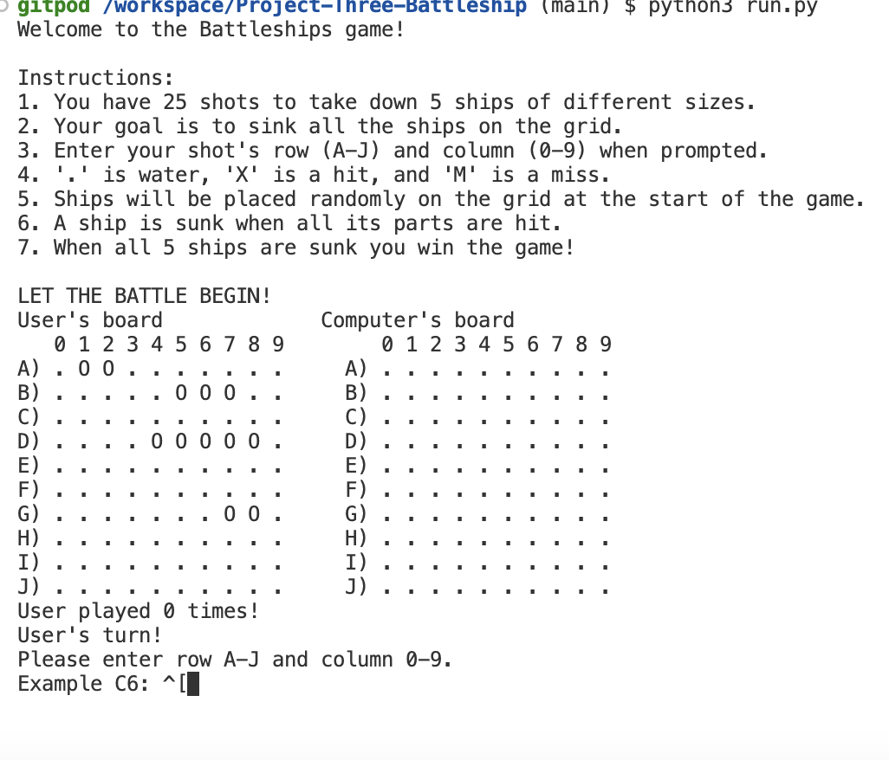
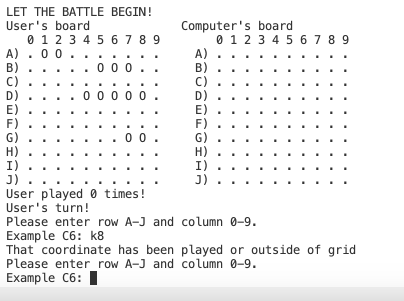
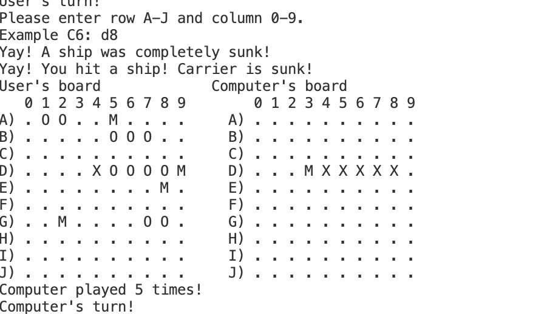
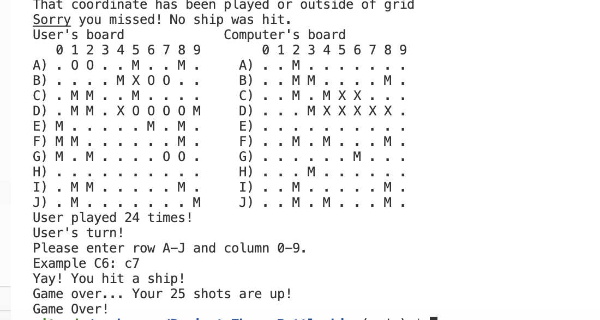
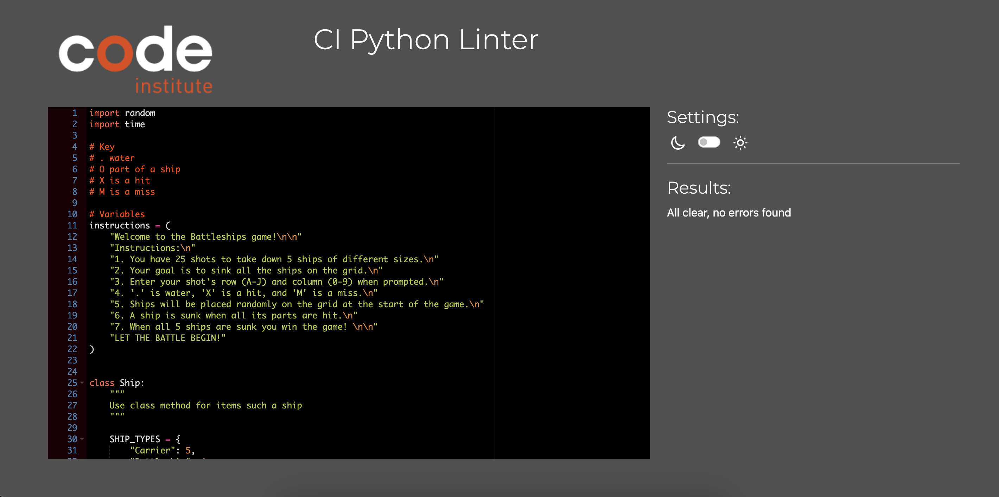

# Battleship Game

This project is a battleship game where a player plays against a computer and the computer plays back against the player.
This is a Python terminal game which runs in the Code Institute mock terminal on Heroku.
There are 2 players in the game - the user and the computer which each have their own board.
The player needs to find all 4 ships and sink the ships before their 25 shots are up or the computer finds and sinks all the player's ships.

# Instructions - How to Play

This version of the game was created entirely within Python. It is designed to be user-friendly and provides the player with instructions on what they need to do and what input needs to be entered in order to play the game. The goal of the game is to sink 4 ships within 25 shots.

A 10x10 board is created by the computer. It then randomly places ships on the board with ship sizes varying from 0 - 5 spots depending on the type of ship it is - carrier, battleship, cruiser, submarine, or destroyer. In this version I have written a legend in the instructions. A full stop “.” indicates empty water, “O” is part of a ship, “X” indicates a ship that has been hit, and “M” is a shot that lands in water because it misses a ship. The user wins against the computer if they can hit and sink 4 ships before their 25 shots are used up or the computer finds and sinks all their ships.

# Resources

This project is based on battleships - read more on [Wikipedia](https://en.wikipedia.org/wiki/Battleship_(game)).
Inspiration for my project was taken from [Knowledge Maven](https://www.youtube.com/watch?v=tF1WRCrd_HQ) and [CS Students](https://www.youtube.com/watch?v=MgJBgnsDcF0). Both helped me with ideas for what I wanted my project to look like. 

# Features

## Existing Features

* Two 10x10 boards are generated by the game - one is the user's board and one is the computer's board
* It is labeled A - J vertically
* It is labeled 0 - 9 horizontally
* The player cannot see the computer's placement of the 4 ships on the computer board
* The player plays against the computer
* The computer also plays against the user
* The player can always see how many shots are left after every shot - it counts up to 25
* The game accepts user input for location of shots - F6 for example
* The input is validated to make sure it is in the correct format and so the user cannot input coordinates outside of the grid
* The input is also checked to see if the player has already made the guess shot, so it doesn't count against them in their shots

What the game looks like

Instructions for the player and the initial boards are seen. On the left is the user's board which the computer will play against and you can see where the game randomly placed ships on the board. The board on the right is where the user will play and make their guesses.

The player cannot see where the ships are located on the computer's board.
This shot also shows that the user cannot enter incorrect data

Shows whether the user hits a ship or misses (X hits, M misses, O ship locations)

Shows the computer's turn as well so the user knows what the computer has done during its turn

Lets the player know if and when they have won the game

## Future Features

* Allow user to adjust board size and size of ships
* Allow user to place the location of their own ships on the board
* Improve UX/UI so that the game is more visually interesting for the user

# Data Model

I created classes as my model for this game - ship, board, player, & game. The game creates two boards - one for the player/user and the second one for the computer to play.
 It stores the range of the grid 10x10, 4 ships of varying sizes, and the player’s guesses based on 25 shots. 

# Testing

I have manually tested this project through the following:

* Passed the code through a PEP8 Linter and confirmed that there were no issues
* I also had friends and family test out my game
* Given it invalid inputs in order to ensure correct input is accepted only
* Tested in my local terminal and Code Institute Heroku terminal

No Linter errors

# Languages
Python was used for this program

# Frameworks, Libraries & Programs Used
* GitHub - to store repository
* Codeanywhere - to write the program
* GitPod - to finish writing my program when I had issues with Codeanywhere
* GitHub - to store my repository for submission
* Heroku - to deploy the live version of the terminal

# BUGS

## Solved Bugs

* Project works as intended
* Lots of errors of lines being too long when pushed through linter, so I needed to change my code

## Bugs Remaining

* No bugs remaining

# Lessons

* I originally created this project as a single user against the computer. The computer didn't have it's own board and/or turn. So I was able to create a basic game with just the player against a computer board. But then I wanted to challenege myself to add the computer as a player as well. However, when I tried to add the computer as another player I couldn't get it to work. I tried for what felt like forever, but nothing seemed to work. A friend suggested just starting over  and having a good outline in the beginning of what I wanted to create. He also suggested creating my project using classes for the objects such as board and player. So I started all over again, with having a better outline of what I wanted my project to look like. So it worked much better when I started from stratch, instead of incorporating a second player into what I initally created as just a single user.
* I changed the name of my project in Github midway through and then had issues pushing my code from codeanywhere back to Github. A lot of trial and errors to fix this issue. After talking with a tutor, I used Gitpod instead.
* Because of summer holiday I spent a lot of time on this project, but with big gaps in-between. This made me struggle when I would go back to the project, I would forget things I changed or that I needed to fix. So in the future, no more big gaps while working on a project
* Because of the things above, I know that I really need to improve my git comments to have better descriptions and more specific descriptions of what I have done
* The debugging process was a lot of trial and error, but I believe helped me to learn Python better

# Deployment

This project was deployed using Code Institute's mock terminal for Heroku.
Steps for deployment:
* Log in to Heroku
* Create a new Heroku app
* Navigate to setting
* Add the following KEY/Value pairs:
    * PORT + 8000
* Add 2 buildbacks - Python and NodeJS in that order
* Go to the Gitpod terminal
    * Type the following commands to the terminal
    * Heroku login -i
    * Enter in username + password
    * Heroku apps
    * heroku git:remote -a my-app-name
    * git add .
    * git commit -m "Deploy to Heroku cia CLI"
    * git push origin main
    * git push heroku main

* Link can be found here: 
* Site is deployed: 

# Credits

* Code Institute for the deployment terminal
* Wikipedia for details of the battleships game
* Inspiration for the game taken from  [CS Students](https://www.youtube.com/watch?v=MgJBgnsDcF0) and [Knowledge Mavens](https://www.youtube.com/watch?v=tF1WRCrd_HQ)

